## Comparison of Illumina vs. PacBio on Mats Ljungman's samples 

### Data download from ENCODE
```bash 
# HCT116
wget https://www.encodeproject.org/files/ENCFF927FEU/@@download/ENCFF927FEU.fastq.gz
wget https://www.encodeproject.org/files/ENCFF191QTD/@@download/ENCFF191QTD.fastq.gz

# PC-3
wget https://www.encodeproject.org/files/ENCFF928NYI/@@download/ENCFF928NYI.fastq.gz
wget https://www.encodeproject.org/files/ENCFF716UHF/@@download/ENCFF716UHF.fastq.gz

# Panc1
wget https://www.encodeproject.org/files/ENCFF776AIM/@@download/ENCFF776AIM.fastq.gz
wget https://www.encodeproject.org/files/ENCFF357ZVF/@@download/ENCFF357ZVF.fastq.gz

# K562
wget https://www.encodeproject.org/files/ENCFF940UIR/@@download/ENCFF940UIR.fastq.gz
wget https://www.encodeproject.org/files/ENCFF493KQW/@@download/ENCFF493KQW.fastq.gz


# GM12878
wget https://www.encodeproject.org/files/ENCFF662UOH/@@download/ENCFF662UOH.fastq.gz
wget https://www.encodeproject.org/files/ENCFF667IFB/@@download/ENCFF667IFB.fastq.gz

# HepG2
wget https://www.encodeproject.org/files/ENCFF241KIB/@@download/ENCFF241KIB.fastq.gz
wget https://www.encodeproject.org/files/ENCFF215BFI/@@download/ENCFF215BFI.fastq.gz

# MCF-7
wget https://www.encodeproject.org/files/ENCFF904SFY/@@download/ENCFF904SFY.fastq.gz
wget https://www.encodeproject.org/files/ENCFF371BBE/@@download/ENCFF371BBE.fastq.gz

# IMR90
wget https://www.encodeproject.org/files/ENCFF095PBU/@@download/ENCFF095PBU.fastq.gz
wget https://www.encodeproject.org/files/ENCFF764VXI/@@download/ENCFF764VXI.fastq.gz

# give files human-readable names
mv ENCFF927FEU.fastq.gz hct116_1.fa.gz
mv ENCFF191QTD.fastq.gz hct116_2.fa.gz
mv ENCFF928NYI.fastq.gz pc3_1.fa.gz
mv ENCFF716UHF.fastq.gz pc3_2.fa.gz
mv ENCFF776AIM.fastq.gz panc1_1.fa.gz
mv ENCFF357ZVF.fastq.gz panc1_2.fa.gz
mv ENCFF940UIR.fastq.gz k562_1.fa.gz
mv ENCFF493KQW.fastq.gz k562_2.fa.gz
mv ENCFF662UOH.fastq.gz gm12878_1.fa.gz
mv ENCFF667IFB.fastq.gz gm12878_2.fa.gz
mv ENCFF241KIB.fastq.gz hepg2_1.fa.gz
mv ENCFF215BFI.fastq.gz hepg2_2.fa.gz
mv ENCFF904SFY.fastq.gz mcf7_1.fa.gz
mv ENCFF371BBE.fastq.gz mcf7_2.fa.gz
mv ENCFF095PBU.fastq.gz imr90_1.fa.gz
mv ENCFF764VXI.fastq.gz imr90_2.fa.gz
```

### Make a file with all the names of the data files 
```bash
echo hct116_1 > datasets.txt
echo hct116_2 >> datasets.txt
echo pc3_1 >> datasets.txt
echo pc3_2 >> datasets.txt
echo panc1_1 >> datasets.txt
echo panc1_2 >> datasets.txt
echo k562_1 >> datasets.txt
echo k562_2 >> datasets.txt
echo gm12878_1 >> datasets.txt
echo gm12878_2 >> datasets.txt
echo hepg2_1 >> datasets.txt
echo hepg2_2 >> datasets.txt
echo mcf7_1 >> datasets.txt
echo mcf7_2 >> datasets.txt
echo imr90_1 >> datasets.txt
echo imr90_2 >> datasets.txt
```

<!-- ### Convert fastqs to bam 
```bash
module load picard/2.18.4

while read p;
do 
    f=${p}.fa.gz
    o=${p}.bam
	picard FastqToSam \
        F1=$f \
        O=$o \
        SM=$p
done < datasets.txt
```

For some reason this isn't working...
```bash
while read p;
do 
    qsub -v "p=${p}" run_picard.sh
done < datasets.txt
```	

### Obtain the fragment length and standard deviation using samtools
```bash

``` -->

### Create a Kallisto index
```bash
wget ftp://ftp.ebi.ac.uk/pub/databases/gencode/Gencode_human/release_29/gencode.v29.transcripts.fa.gz

module load kallisto/0.46.1

fa=gencode.v29.transcripts.fa.gz
idx=gencode.v29.transcripts.idx

kallisto index -i $idx $fa
```

### Run Kallisto
```bash
while read p;
do 
    qsub -v "p=${p}" run_kallisto.sh
done < datasets.txt
```

### Get a TALON abundance file for each of the long-read samples
```bash
pb_pref=/share/crsp/lab/seyedam/share/PACBIO/
pb_suf=/TALON/full_gencode_v29_SIRV_2020-08-16.db
printf "PB215\thct116\n" > pb_ids.txt
printf "PB216\tpc3\n" >> pb_ids.txt
printf "PB217\tpanc1\n" >> pb_ids.txt
printf "PB218\tk562\n" >> pb_ids.txt
printf "PB219\tgm12878\n" >> pb_ids.txt
printf "PB220\thepg2\n" >> pb_ids.txt
printf "PB221\tmcf7\n" >> pb_ids.txt
printf "PB222\timr90\n" >> pb_ids.txt

while IFS=$'\t' read -r pb_id cell_type;
do 
	# echo ${pb_pref}${pb_id}${pb_suf}
    talon_abundance \
    	--db ${pb_pref}${pb_id}${pb_suf} \
    	-a gencode_v29_SIRV \
    	-b hg38_SIRV \
    	--o ${cell_type}
done < pb_ids.txt
```

### Gene quantification correlation plots for each of the replicates
These are 
* Without genes shorter than 200 bp
* No mitochondrial genes
* No pseudo genes
* Genes that are expressed in both datasets
* Known genes only

```bash
echo "" > gene_output.txt
while IFS=$'\t' read -r pb_id cell_type;
do 
    python plot_longread_illumina_correlation.py \
    	-f ${cell_type}_talon_abundance.tsv \
    	-dname ${pb_id} \
    	-ik1 kallisto_${cell_type}_1/abundance.tsv \
    	-ik2 kallisto_${cell_type}_2/abundance.tsv \
    	-gt_type gene \
    	-celltype ${cell_type} \
    	-o figures/ 
# done < pb_ids.txt >> gene_output.txt
done < pb_bb.txt
```

#### Gene-level correlations

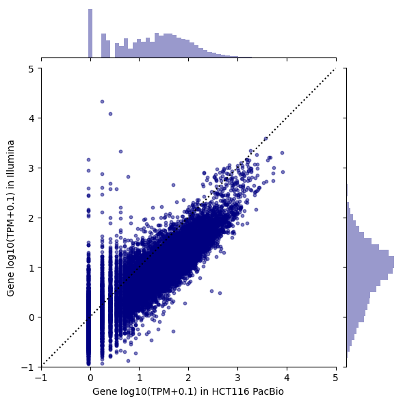

```text
14118 shared genes after filtering
Pearson r: 0.05820259975890311 
Spearman rho: 0.8516083700319128
```

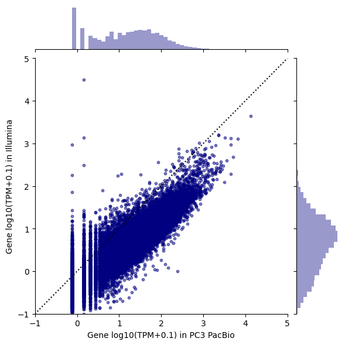

```text
15287 shared genes after filtering
Pearson r: 0.011957992265875989 
Spearman rho: 0.8669038059425254
```

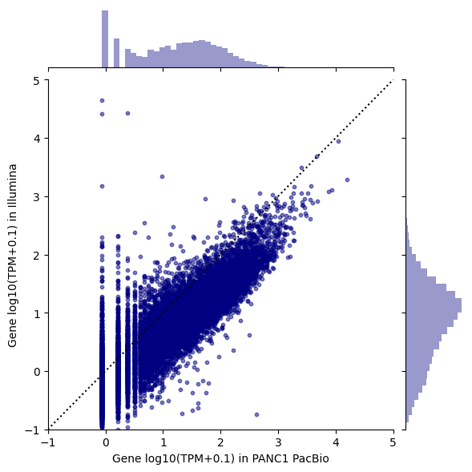

```text
14442 shared genes after filtering
Pearson r: 0.04610189868792925 
Spearman rho: 0.8627319469186795
```


```text
14092 shared genes after filtering
Pearson r: 0.07175469474784335 
Spearman rho: 0.8655871766844946
```


```text
13587 shared genes after filtering
Pearson r: 0.037996443474376265 
Spearman rho: 0.8578077300655174
```


```text
13638 shared genes after filtering
Pearson r: 0.19694643532011877 
Spearman rho: 0.8434554570963068
```

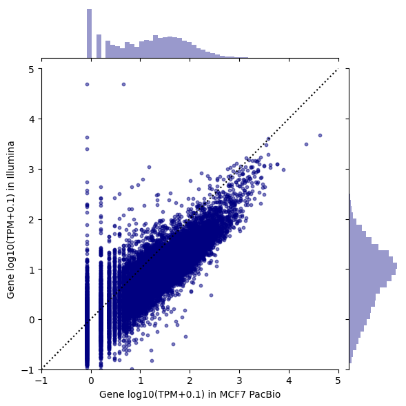

```text
14208 shared genes after filtering
Pearson r: 0.04259595141004493 
Spearman rho: 0.8488766227079094
```


```text
13358 shared genes after filtering
Pearson r: 0.3514345855581529 
Spearman rho: 0.838129200396925
```


#### Gene-level correlations colored by gene len


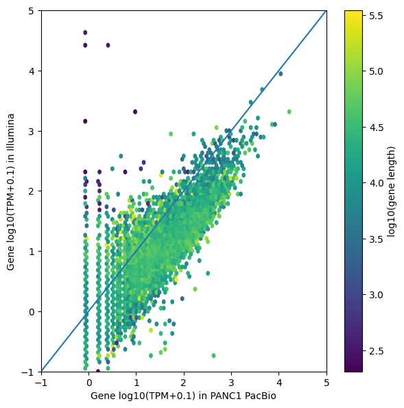


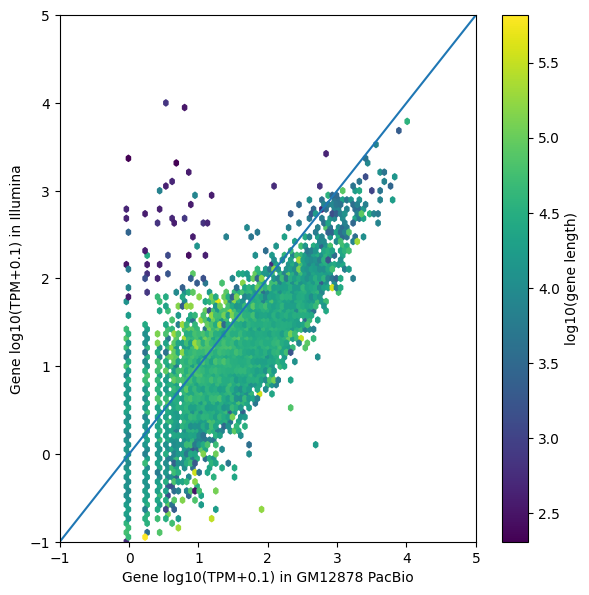


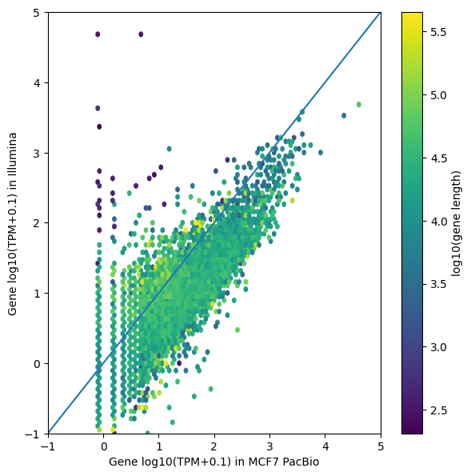


#### Gene-level correlations for genes that only have one annotated isoform

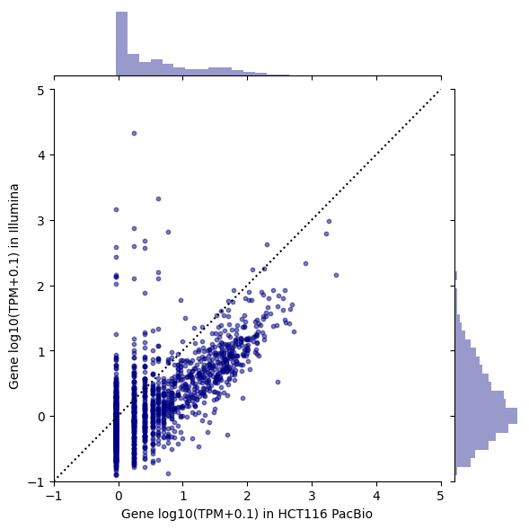

```text
Pearson r: 0.00161143062481415 
Spearman rho: 0.6587783877971751
```


```text
Pearson r: -0.0029690964191770126 
Spearman rho: 0.636308647540778
```

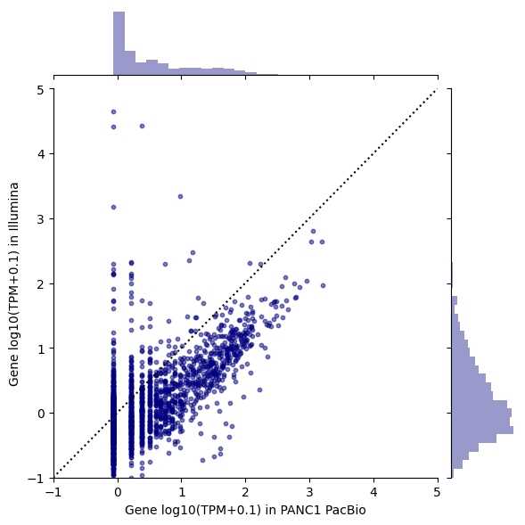

```text
Pearson r: -0.0032145447702248654 
Spearman rho: 0.6256498715773239
```


```text
Pearson r: 0.008374598253693293 
Spearman rho: 0.6361336849667039
```


```text
Pearson r: 0.000792385006215637 
Spearman rho: 0.6273349016535682
```


```text
Pearson r: 0.026408944064780608 
Spearman rho: 0.6543969981075688
```


```text
Pearson r: -0.0012901853808778136 
Spearman rho: 0.6529269713861924
```


```text
Pearson r: 0.11858685263741038 
Spearman rho: 0.6933528201972302
```

### Also get transcript quantification correlation plots for each of the replicates
* Without genes shorter than 200 bp
* No mitochondrial genes
* No pseudo genes
* Transcripts that are expressed in both datasets
* Known transcripts only

```bash
echo "" > trancript_output.txt
while IFS=$'\t' read -r pb_id cell_type;
do 
    python plot_longread_illumina_correlation.py \
    	-f ${cell_type}_talon_abundance.tsv \
    	-dname ${pb_id} \
    	-ik1 kallisto_${cell_type}_1/abundance.tsv \
    	-ik2 kallisto_${cell_type}_2/abundance.tsv \
    	-gt_type transcript \
    	-celltype ${cell_type} \
    	-o figures/
# done < pb_ids.txt >> transcript_output.txt
done < pb_bb.txt
```

#### Transcript-level correlations


```text
21608 shared transcripts after filtering
Pearson r: 0.021089187423237427 
Spearman rho: 0.5221974319975791
```


```text
23970 shared transcripts after filtering
Pearson r: 0.0028855201142967586 
Spearman rho: 0.5236015842478414
```

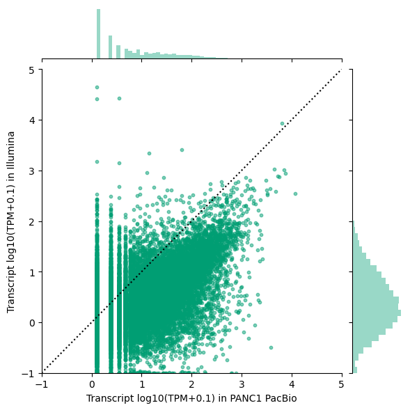

```text
23017 shared transcripts after filtering
Pearson r: 0.021125937006438972 
Spearman rho: 0.5223172617512439
```


```text
22990 shared transcripts after filtering
Pearson r: 0.028857304734847752 
Spearman rho: 0.516259671977989
```

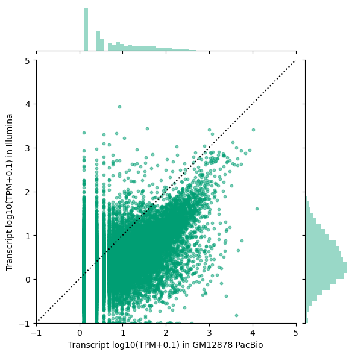

```text
21206 shared transcripts after filtering
Pearson r: 0.012965389294442516 
Spearman rho: 0.5123570616277948
```


```text
21458 shared transcripts after filtering
Pearson r: 0.05442295154333217 
Spearman rho: 0.5368025047651823
```


```text
22023 shared transcripts after filtering
Pearson r: 0.012356155593479662 
Spearman rho: 0.5118313191586679
```

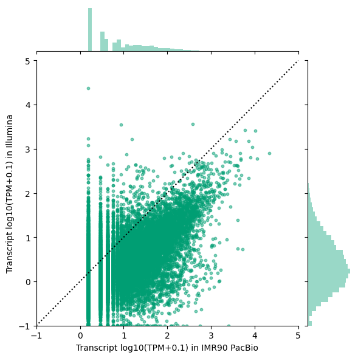

```text
19102 shared transcripts after filtering
Pearson r: 0.1642848290525089 
Spearman rho: 0.5303419517456668
```

#### Transcript-level correlations colored by transcript length


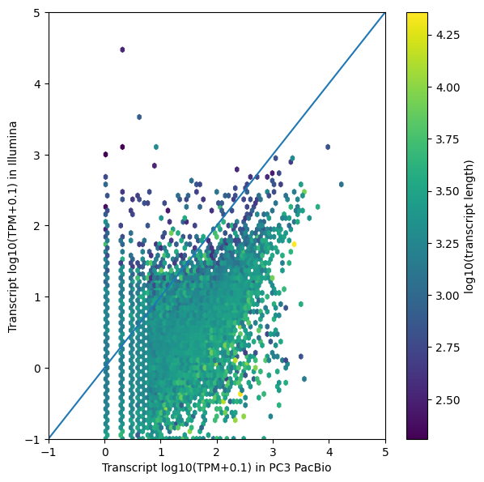


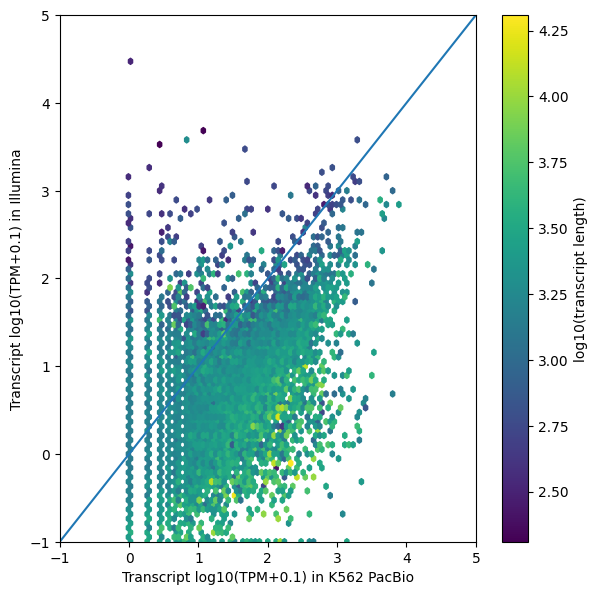


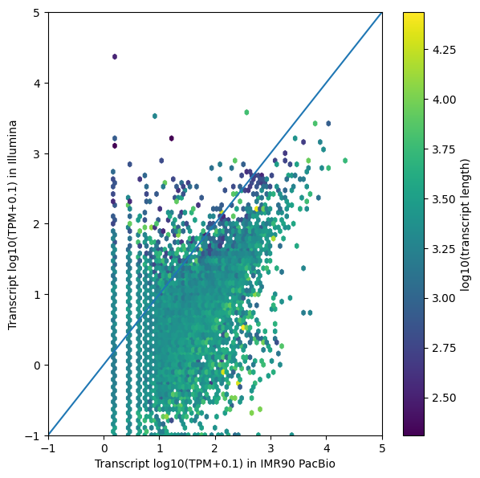


## Illumina GM12878 polyA+ vs. ribominus

The data from Mats is rRNA depleted, so we want to see how polyA+ datasets compare to his.

### Download the data
```bash
mkdir illumina_polya
cd illumina_polya/

# rep 1, reads 1 and 2
wget https://www.encodeproject.org/files/ENCFF001RVY/@@download/ENCFF001RVY.fastq.gz
wget https://www.encodeproject.org/files/ENCFF001RVR/@@download/ENCFF001RVR.fastq.gz

# rep 2, reads 1 and 2
wget https://www.encodeproject.org/files/ENCFF001RVS/@@download/ENCFF001RVS.fastq.gz
wget https://www.encodeproject.org/files/ENCFF001RVW/@@download/ENCFF001RVW.fastq.gz

mv ENCFF001RVY.fastq.gz gm12878_1_1.fa.gz
mv ENCFF001RVR.fastq.gz gm12878_1_2.fa.gz
mv ENCFF001RVS.fastq.gz gm12878_2_1.fa.gz
mv ENCFF001RVW.fastq.gz gm12878_2_2.fa.gz

echo "gm12878_1" > datasets.txt
echo "gm12878_2" >> datasets.txt

cd ../
```

### Run Kallisto
```bash
while read p;
do 
    qsub -v "p=${p}" run_kallisto_pe.sh
done < datasets.txt
```

### Plot the correlations for gene and transcript
* Without genes shorter than 200 bp
* No mitochondrial genes
* No pseudogenes
* Genes/Transcripts that are expressed in both datasets
* Known genes/transcripts only
```bash
mkdir -p illumina_polya/figures/

i1_1=illumina_polya/kallisto_gm12878_1/abundance.tsv
i1_2=illumina_polya/kallisto_gm12878_2/abundance.tsv
i2_1=kallisto_gm12878_1/abundance.tsv
i2_2=kallisto_gm12878_2/abundance.tsv
python plot_correlation.py \
	-i1_1 $i1_1 \
	-i1_2 $i1_2 \
	-s1_type "Illumina polyA+" \
	-i2_1 $i2_1 \
	-i2_2 $i2_2 \
	-s2_type "Illumina rRNA-" \
	-celltype gm12878 \
	-gt_type gene \
	-o illumina_polya/figures/

python plot_correlation.py \
	-i1_1 $i1_1 \
	-i1_2 $i1_2 \
	-s1_type "Illumina polyA+" \
	-i2_1 $i2_1 \
	-i2_2 $i2_2 \
	-s2_type "Illumina rRNA-" \
	-celltype gm12878 \
	-gt_type transcript \
	-o illumina_polya/figures/
```


```text
21703 shared genes after filtering
Pearson r: 0.029895983129730106 
Spearman rho: 0.8109599980436095
```


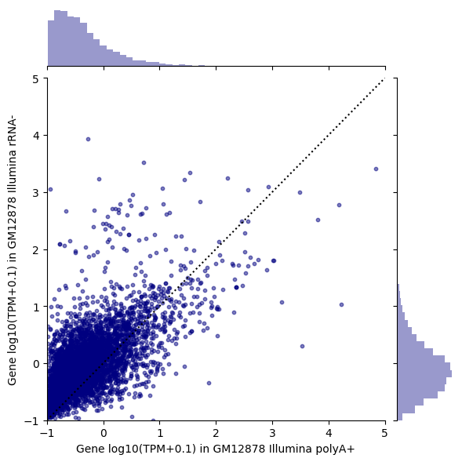

```text
Pearson r: 0.011975892173405346 
Spearman rho: 0.6568639386845537
```

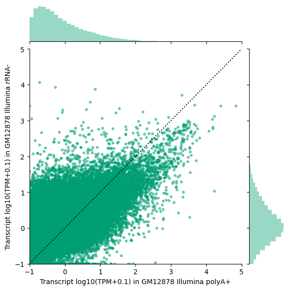

```text
55870 shared transcripts after filtering
Pearson r: 0.021460221811021214 
Spearman rho: 0.5665595673810594
```

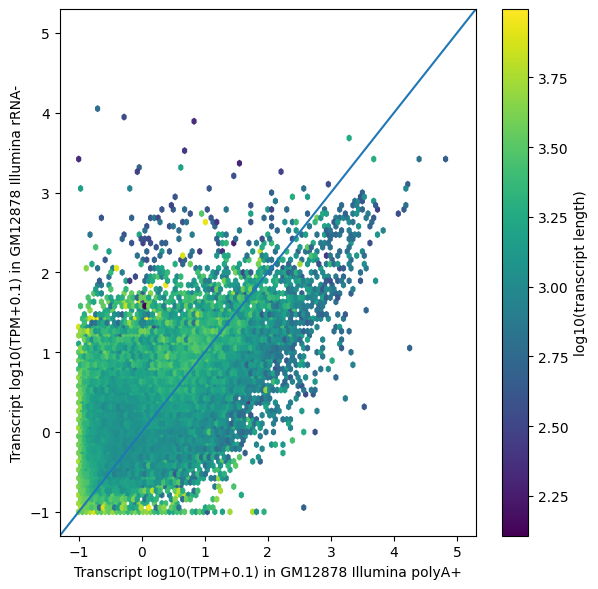

## PacBio GM12878 old protocol vs. new protocol

For the old protocol, we will use the data we used for the TALON manuscript. We'll use PB126, or Rep2, because that one looks better.

```bash 
mkdir -p old_protocol/figures

old=~/talon_data/revisions_1-20/human_TALON/pb_talon_abundance.tsv 
new=gm12878_talon_abundance.tsv
python plot_longread_correlation.py \
	-f1 $new \
	-d1 PB219 \
	-s1_type "new protocol" \
	-f2 $old \
	-d2 PB_GM12878_R2 \
	-s2_type "old protocol" \
	-celltype gm12878 \
	-gt_type gene \
	-o old_protocol/figures/

python plot_longread_correlation.py \
	-f1 $new \
	-d1 PB219 \
	-s1_type "new protocol" \
	-f2 $old \
	-d2 PB_GM12878_R2 \
	-s2_type "old protocol" \
	-celltype gm12878 \
	-gt_type transcript \
	-o old_protocol/figures/
```

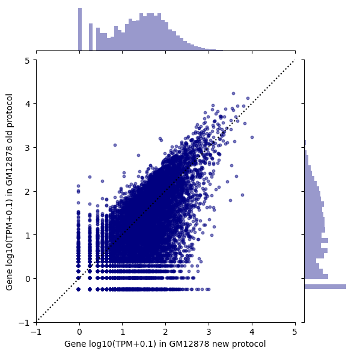

```text
11191 shared genes after filtering
Pearson r: 0.6684362653401079 
Spearman rho: 0.6364278192906659
```

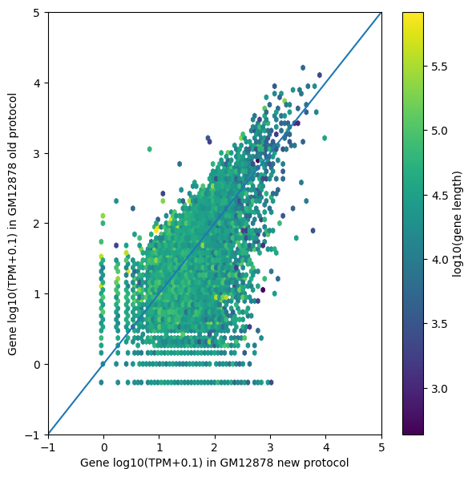

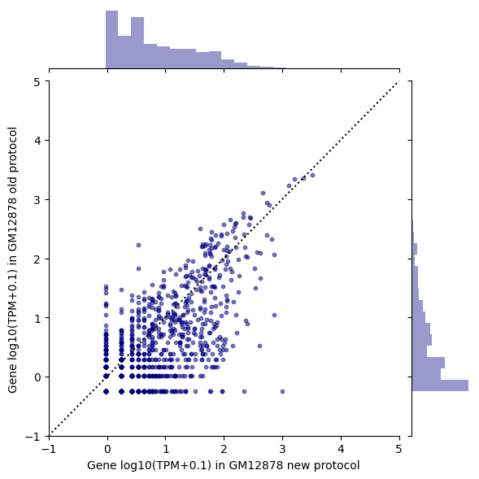

```text
Pearson r: 0.8703078736580908 
Spearman rho: 0.6165535180687299
```

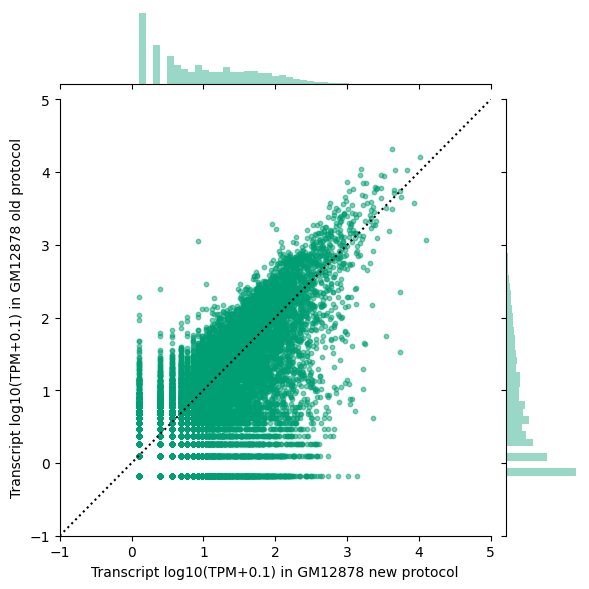

```text
14875 shared transcripts after filtering
Pearson r: 0.6742673681007301 
Spearman rho: 0.6464974732202716
```

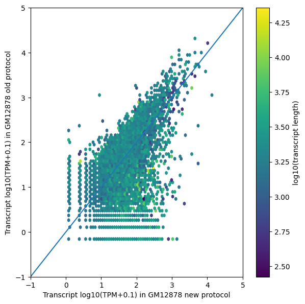

<!-- 
### Get the length dists of shared gene sets
```bash
while IFS=$'\t' read -r pb_id cell_type;
do 
    python plot_gene_len_dists.py \
     	-f figures/PacBio-Illumina_${cell_type}_gene_count_mutualGenes.csv \
    	-c ${cell_type} \
    	-o figures/${cell_type}
done < pb_bb.txt
``` -->